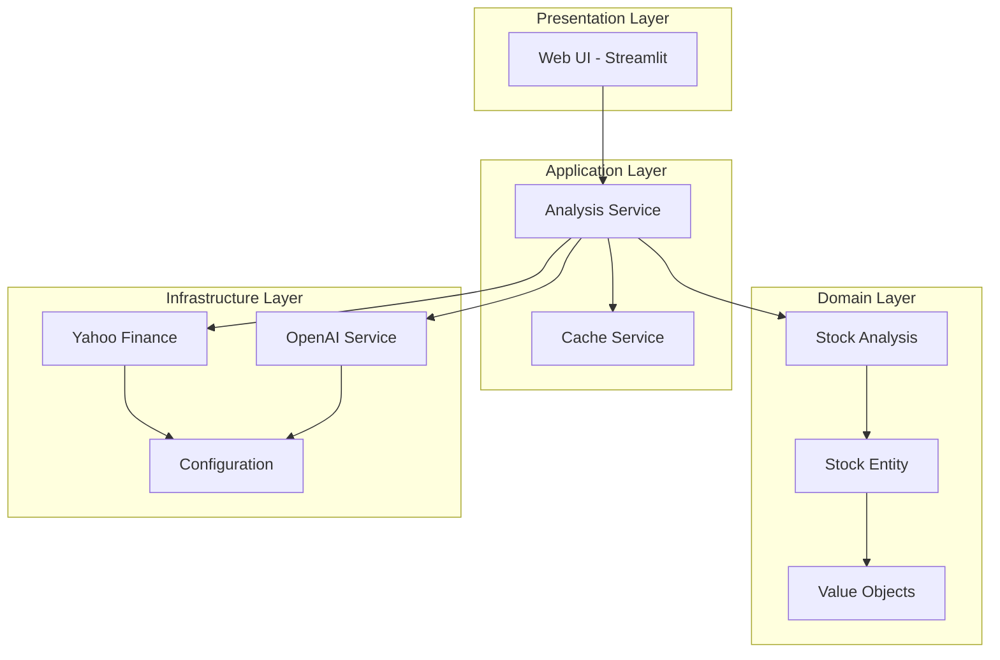
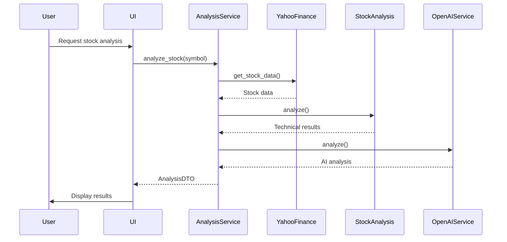
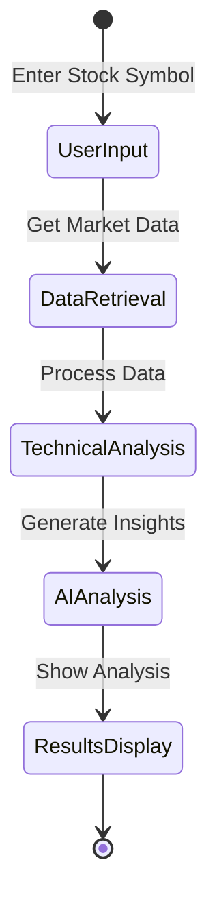

# Stock Analysis System - System Design Document

## 1. System Overview

### 1.1 Purpose
The Stock Analysis System is designed to provide real-time stock analysis by combining technical indicators with AI-powered insights, offering users comprehensive market analysis and trading recommendations.

### 1.2 Architecture Overview



## 2. System Components

### 2.1 Core Components

#### Domain Layer
- **Stock Analysis Aggregate**
  - Purpose: Centralizes analysis logic
  - Key Functions: Technical analysis, trend analysis, signal generation
  - Dependencies: Stock, Price entities

- **Stock Entity**
  - Purpose: Represents stock data
  - Key Attributes: Symbol, name, price history
  - Behaviors: Technical indicator calculations

#### Application Layer
- **Analysis Service**
  ```python
  class AnalysisService:
      async def analyze_stock(self, symbol: str) -> AnalysisDTO:
          stock_data = await self.market_data.get_stock_data(symbol)
          analysis = StockAnalysis(stock_data)
          technical_results = analysis.analyze()
          ai_analysis = await self.llm_service.analyze(
              technical_results,
              stock_data
          )
          return self._create_analysis_dto(technical_results, ai_analysis)
  ```

#### Infrastructure Layer
- **Market Data Service (Yahoo Finance)**
  ```python
  class YahooFinance(MarketDataInterface):
      async def get_stock_data(self, symbol: str) -> Stock:
          # Implementation
          pass

      async def get_real_time_price(self, symbol: str) -> Price:
          # Implementation
          pass
  ```

### 2.2 Data Flow


## 3. Technical Specifications

### 3.1 Technology Stack
- Backend: Python 3.9+
- Frontend: Streamlit
- External APIs:
  - Yahoo Finance API
  - OpenAI API
- Data Storage: In-memory (Phase 1)

### 3.2 Key Interfaces

```python
# Market Data Interface
class MarketDataInterface(ABC):
    @abstractmethod
    async def get_stock_data(self, symbol: str) -> Stock:
        pass

# LLM Service Interface
class LLMServiceInterface(ABC):
    @abstractmethod
    async def analyze(self, technical_data: Dict, stock_data: Stock) -> str:
        pass
```

## 4. System Behavior

### 4.1 Main Workflows



### 4.2 Error Handling
```python
class StockAnalysisError(Exception):
    pass

class MarketDataError(StockAnalysisError):
    pass

class AnalysisError(StockAnalysisError):
    pass
```

## 5. Performance Considerations

### 5.1 Caching Strategy
```python
class CacheService:
    def __init__(self):
        self.cache = {}
        self.ttl = 300  # 5 minutes

    async def get_or_fetch(self, key: str, fetch_func: Callable):
        if key in self.cache and not self._is_expired(key):
            return self.cache[key]
        
        data = await fetch_func()
        self.cache[key] = {
            'data': data,
            'timestamp': datetime.now()
        }
        return data
```

### 5.2 Optimization Techniques
- Async operations
- Data caching
- Batch processing
- Resource pooling


## 8. Deployment

### 8.1 Requirements
```requirements.txt
streamlit>=1.8.0
yfinance>=0.1.70
openai>=0.27.0
python-dotenv>=0.19.0
```

### 8.2 Environment Setup
```bash
python -m venv venv
source venv/bin/activate
pip install -r requirements.txt
```

## 9. Future Enhancements

### Phase 2
- Database integration
- User authentication
- Portfolio management
- Advanced analytics
